# kindle-todo

Show a shared **Microsoft To Do** list, full-screen, on a wall-mounted
**jailbroken Kindle Paperwhite** — a silent, always-on, e-ink family todo board.

The Kindle displays the list; People adds and completes tasks as usual in Microsoft ToDo; The wall updates within seconds.

<p align="center">
  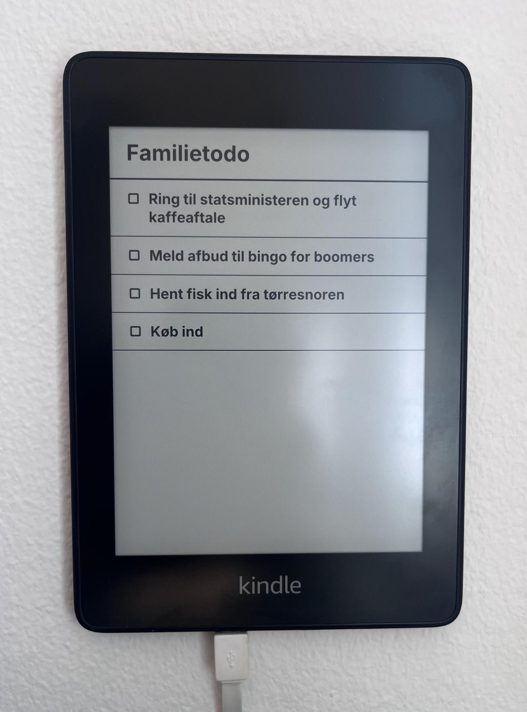
  <br>
  <sub><em>The real thing: the hallway "Familietodo" on a wall-mounted Kindle.</em></sub>
</p>

---

## Why

We wanted the household "Familietodo" list visible in the hallway without a
glowing tablet or a browser tab left open somewhere. An old Kindle Paperwhite is
perfect for this: e-ink is easy on the eyes, sips power, and holds its image with
zero backlight. Jailbroken, it can be turned into a dedicated display.

The catch: a Kindle can't natively talk to the Microsoft Graph API, its 2018-era
browser is rough, and its UI wants to draw a home screen / screensaver over
anything you put up. So all the real work happens in a **Cloudflare Worker**, and
the Kindle becomes a thin client that just fetches an image and draws it.

## Daily use

- you do your thing
- the wall updates
- you use the simple webapp to pick which one of your lists that goes to the kindle

---

## Architecture

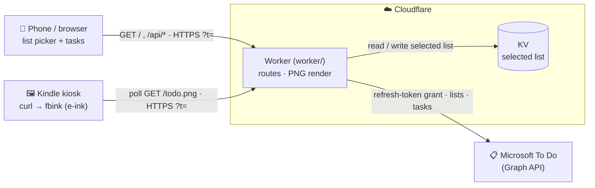

The Kindle just fetches an image and draws it; the phone picks which list is
served. All data + rendering logic lives in the Worker.

### The Worker (`worker/`)

TypeScript, deployed to Cloudflare. Zero runtime dependencies beyond the PNG
renderer.

- **Provider abstraction** (`src/providers/`) — the app depends on a small
  `TodoProvider` interface (`lists()`, `title(listId?)`, `list(listId?)`); a
  `factory` picks the implementation from config. Microsoft To Do
  (`providers/microsoft/`) is the only backend today, wrapping a ported,
  zero-dependency Microsoft Graph client (refresh-token grant). Adding another
  source is a new class + one line in the factory.
- **List picker** — the web page lists every To Do list and lets you choose
  which one is served to the Kindle. The choice is persisted in the `LIST_STORE`
  KV namespace (falling back to `MS_DEFAULT_LIST_ID`), so the Kindle's next poll
  picks it up. Tasks are completed in the upstream To Do app, not here.
- **`/todo.png`** — the list rendered to a 1072×1448 grayscale PNG using
  [`@cf-wasm/og`](https://github.com/fineshopdesign/cf-wasm) (satori + resvg) —
  **no headless browser**, so it's fast and free.
- **Efficiency** — the provider list is cached ~30s (so the Kindle's 15s polling
  doesn't hammer Graph); `/todo.png` returns an `ETag` and answers conditional
  requests with a tiny `304`, and a Cache API layer means the image is
  rasterized at most once per change. Switching the served list invalidates the
  cache for an immediate refresh.
- **Friendly errors** — when Graph fails, `/todo.png` first keeps serving the
  **last-known-good** list for a ~5-min grace window (rides out blips), then
  falls back to a rendered error screen — "sign-in expired 🔑", "list gone 🤔",
  or "not responding 😵" (`src/errors.ts`). Failures the Worker can't answer at
  all (no Wi-Fi, wrong URL) are handled on the device instead — see
  [Resilience & recovery](#resilience--recovery). `GET /error/<kind>.png` renders
  any screen, which is how the device pre-downloads its local fallbacks.
- **Access** — every data route (`/api/*`, `/todo.png`) requires
  `?t=<TODO_TOKEN>`, a shared secret in the URL (Cloudflare Access would break
  the unattended kiosk). The page shell at `/` is public and holds no data; it
  reads the token from the URL, else `localStorage`, else a prompt, then reuses
  it on the API calls.

**Inside the Worker** — router, provider, storage (KV + Cache API) and secrets:

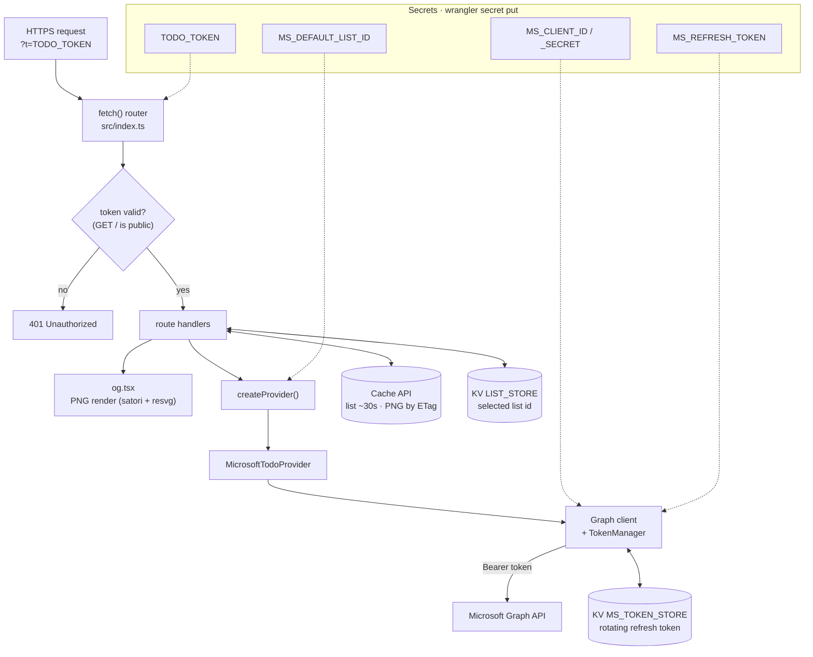

**Endpoints in action** — the phone drives the picker while the Kindle polls the
image independently:

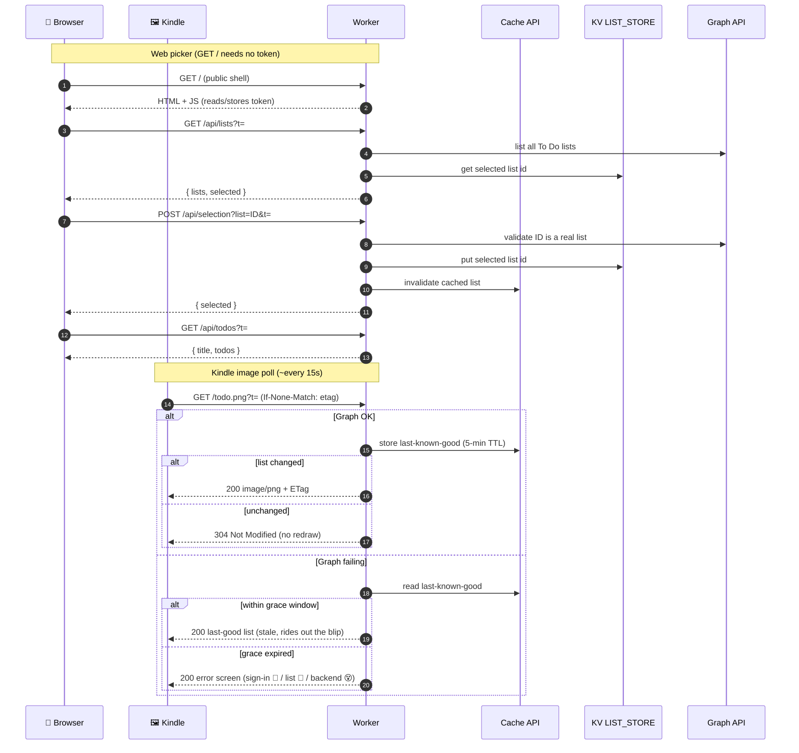

### The Kindle (`extensions/kindletodo/`)

A jailbroken Kindle running a tiny KUAL extension plus an Upstart boot service.

- **`bin/boot-image.sh`** — on boot, stops the **entire X display stack** (the
  `x` Upstart job: lxinit + framework + pillow + the `blanket` screensaver) so
  nothing repaints over us, sets the frontlight, and launches the loop. Stopping
  `lab126_gui` alone is *not* enough — `blanket` keeps drawing the charge screen.
- **`bin/image-loop.sh`** — polls `/todo.png` with a conditional request
  (`curl --etag-compare/--etag-save`) and redraws e-ink with **`fbink`** only
  when the state changes (a `200`); `304`s cost nothing and cause no flashing.
- **`kindletodo.upstart.conf`** — the Upstart unit (installed to
  `/etc/upstart/kindletodo.conf`) that supervises `boot-image.sh` with `respawn`.

The Kindle is a dumb display: fetch image, draw, repeat. All appearance and data
logic lives in the Worker, so changing the look is a redeploy — no device access.

**Boot + poll loop** — Upstart supervises `boot-image.sh`, which takes over the
panel and hands off to the `image-loop.sh` redraw loop:

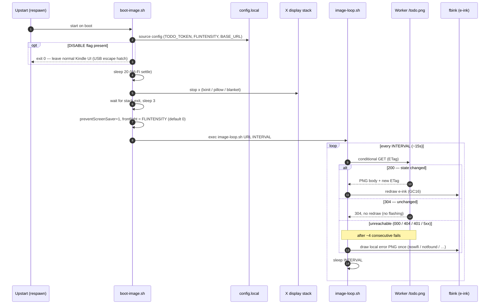

---

## Repository layout

```
worker/                         Cloudflare Worker
  src/
    index.ts                    routes: page, /api/lists, /api/selection, /api/todos, /todo.png
    og.tsx                      PNG render: list + error screens (satori/resvg)
    errors.ts                   error-screen catalog + failure classifier
    providers/
      types.ts                  TodoProvider interface + Todo type
      factory.ts                createProvider(env)
      microsoft/                ported Graph client + MicrosoftTodoProvider
  test/                         client + error-classifier unit tests (vitest)
  wrangler.jsonc                Worker config
  .dev.vars.example             local Worker secrets template
extensions/kindletodo/          Kindle KUAL extension
  bin/boot-image.sh             boot: stop X stack, set light, run loop
  bin/image-loop.sh             poll /todo.png, fbink on change, error screens
  bin/config.example.sh         device-local config template (token)
  assets/                       error PNGs (downloaded by kindle.sh deploy)
  kindletodo.upstart.conf       Upstart service (-> /etc/upstart/)
  config.xml, menu.json         KUAL registration
scripts/kindle.sh               deploy to / ssh the Kindle using .env
.env.example                    ops env template (token, Kindle IP + SSH pass)
docs/devices/                   hardware spec of the target Kindle (PW4)
```

---

## Getting it running on a fresh Kindle

### Prerequisites

- A **jailbroken Kindle Paperwhite** (tested on PW4 / 10th gen; any 1072×1448
  300 ppi panel — PW3/Voyage — should work). Jailbreak + tooling via
  [kindlemodding.org](https://kindlemodding.org): install **KUAL**, **fbink**
  (bundled with KOReader / the `libkh` helpers), and **USBNetLite** for SSH.
- A **Cloudflare account** (free tier is enough).
- **Node + npm** and **wrangler** on your computer.
- **Microsoft Graph access to To Do**: an Azure app registration
  (`client_id` / `client_secret`, scope
  `offline_access https://graph.microsoft.com/Tasks.ReadWrite`) and a
  **refresh token** obtained once via an interactive OAuth login. The
  [`microsoft-todo-cli`](https://github.com/) this Worker's client is ported from
  can produce one, or use any authorization-code flow.

### Part A — Deploy the Worker

```bash
cd worker
npm install
cp .dev.vars.example .dev.vars     # then fill in real values
```

Fill `.dev.vars`:

| Var | What |
|-----|------|
| `TODO_TOKEN` | a long random string; the access gate for every URL |
| `MS_CLIENT_ID` / `MS_CLIENT_SECRET` | your Azure app registration |
| `MS_REFRESH_TOKEN` | Microsoft refresh token (obtained once) |
| `MS_DEFAULT_LIST_ID` | the To Do list to show (see below) |

Test locally (uses `.dev.vars`), then deploy:

```bash
npm run dev            # http://localhost:8787/?t=<TODO_TOKEN>
wrangler login
# push each secret to production:
for k in TODO_TOKEN MS_CLIENT_ID MS_CLIENT_SECRET MS_REFRESH_TOKEN MS_DEFAULT_LIST_ID; do
  printf '%s' "$(grep "^$k=" .dev.vars | cut -d= -f2- | tr -d '"')" | wrangler secret put "$k"
done
wrangler deploy        # -> https://<yourdomain>
```

Your `<yourdomain>` can just be the free Cloudflare **`*.workers.dev`** URL you
get out of the box (e.g. `kindletodo.<your-subdomain>.workers.dev`) — no custom
domain or DNS needed. A custom domain (as configured in this repo's
`wrangler.jsonc`) is purely optional.

> **Heads-up:** the checked-in `wrangler.jsonc` declares a `custom_domain` route.
> If you keep a `custom_domain` route, it **disables the `*.workers.dev` URL**
> unless you also set `"workers_dev": true` — so the Worker becomes reachable
> *only* at that custom domain. If you just want the free `workers.dev` URL,
> **remove the `routes` line** from `wrangler.jsonc`. Either way, point the Kindle
> at whatever `<yourdomain>` you end up with (Part B).

**Finding your list id:** list your To Do lists via the Graph explorer
(`GET /me/todo/lists`) or a small script, and copy the `id` of the list you want
into `MS_DEFAULT_LIST_ID`.

**Optional (recommended for 24/7):** Microsoft rotates the refresh token on each
use. Persist it so it survives cold starts:

```bash
wrangler kv namespace create MS_TOKEN_STORE   # add the id to wrangler.jsonc, uncomment the binding
```

### Part B — Set up the Kindle

1. **Install the extension.** Mount the Kindle over USB and copy
   `extensions/kindletodo/` to `/mnt/us/extensions/kindletodo/`. The frontlight
   (`FLINTENSITY`, 0 = off … 24 = max, **default 0**) and poll `INTERVAL` default
   in `bin/boot-image.sh` but are overridable per-device in `bin/config.local`;
   the **token is not committed** — it's provisioned separately (step 4).

2. **Enable SSH.** In KUAL, enable **USBNetLite** (over Wi-Fi). Change its
   default password (`/mnt/us/usbnetlite/etc/config`) from `kindle`.

3. **Install the boot service** (needs a one-time root shell). Over SSH:
   ```sh
   mntroot rw
   cp /mnt/us/extensions/kindletodo/kindletodo.upstart.conf /etc/upstart/kindletodo.conf
   mntroot ro
   initctl reload-configuration
   ```

4. **Provision the token + push updates from your laptop.** Create the ops
   `.env` (see [Secrets & the `.env`](#secrets--the-env) below), then:
   ```sh
   cp .env.example .env      # fill in TODO_TOKEN, KINDLE_IP, KINDLE_SSH_PASS
   scripts/kindle.sh deploy  # copies bin/*.sh, writes the token, restarts service
   ```
   `deploy` writes `bin/config.local` on the device (the token — never committed)
   and restarts the kiosk. Re-run it any time you change the scripts or rotate the
   token. Handy: `scripts/kindle.sh logs`, `scripts/kindle.sh status`,
   `scripts/kindle.sh ssh`.

5. **Reboot.** The Kindle boots, stops the display stack, and comes up to the
   full-screen list. It now updates itself forever.

> **Power:** run it from a **wall charger**, not a computer's USB port
> (a USB-data connection interferes with Wi-Fi SSH). In kiosk mode the device
> stays awake to poll, so keep it powered.

**Revert to a normal Kindle:** the quick escape hatch is the `DISABLE` flag
(drop a file over USB — no shell needed); to remove it for good, delete the boot
service. See [Resilience & recovery](#resilience--recovery).

---

## Using it

- **See it:** the Kindle shows the list; it redraws within ~15 s of a change.
- **Choose the list:** open `https://<yourdomain>/?t=<TODO_TOKEN>`
  on any device and pick which To Do list the Kindle serves; the wall follows on
  its next poll.
- **Tick items off:** complete tasks in Microsoft To Do itself — the wall follows.
- **Change the look:** edit `worker/src/og.tsx` and `wrangler deploy`. No device
  access needed; the Kindle picks it up on its next poll.
- **Adjust brightness:** the frontlight defaults to **off**. Easiest: set
  `KINDLE_FLINTENSITY=<0-24>` in `.env` and run `scripts/kindle.sh deploy`.
  Live (no redeploy): `scripts/kindle.sh ssh 'lipc-set-prop com.lab126.powerd flIntensity <0-24>'`.

---

## Notes & gotchas (learned the hard way)

- **The charge-screen "bar":** stopping only `lab126_gui` leaves the `blanket`
  screensaver running under `x`; while charging it paints the battery graphic
  over the image. Stop the whole **`x`** job (as `boot-image.sh` does).
- **HTTPS on the old browser:** the Kindle's `curl`/OpenSSL do modern TLS fine,
  so it reaches the Cloudflare edge (custom domain or `workers.dev`) over HTTPS
  without trouble.
- **Blinking:** e-ink redraws flash, so the loop redraws **only on change**.
- **Security:** the token is kept out of git — it lives in the deployed
  Cloudflare secret, the git-ignored `worker/.dev.vars` and `.env`, and the
  device's uncommitted `config.local`. Rotate it (below) if it ever leaks.

## Error screens

When something breaks, the wall shows a friendly full-screen message instead of
a silently stale (or frozen) list. They fall into two groups by *where* they're
drawn — because a screen can only be rendered while the Worker is reachable.

**Rendered by the Worker** — served in place of the list when Microsoft Graph
fails, after a ~5-min last-known-good grace window:

| Screen | Means | What to do |
|:------:|-------|------------|
| 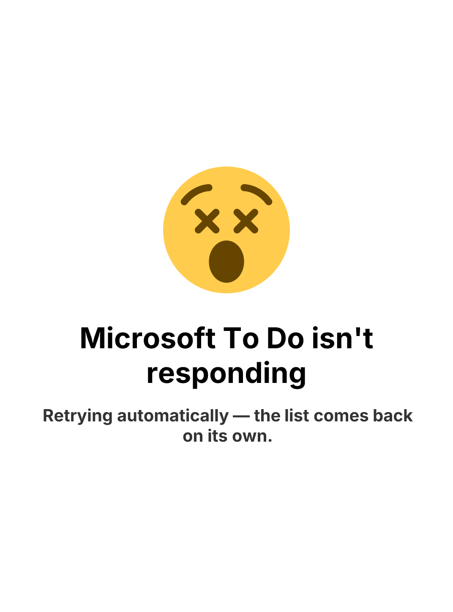 | **Microsoft To Do isn't responding** — Graph is down, timing out, or rate-limiting. | Nothing — transient, clears itself. |
|  | **Sign-in expired** — the refresh token was revoked or expired. | Mint a new refresh token and update the `MS_REFRESH_TOKEN` secret. |
|  | **List gone** — the selected list was deleted in To Do. | Pick another list in the web app. |

**Drawn on the Kindle** — the Worker is unreachable, so the device draws a local
PNG (pre-downloaded by `scripts/kindle.sh deploy`) after ~1 min of failed polls:

| Screen | Means | What to do |
|:------:|-------|------------|
| 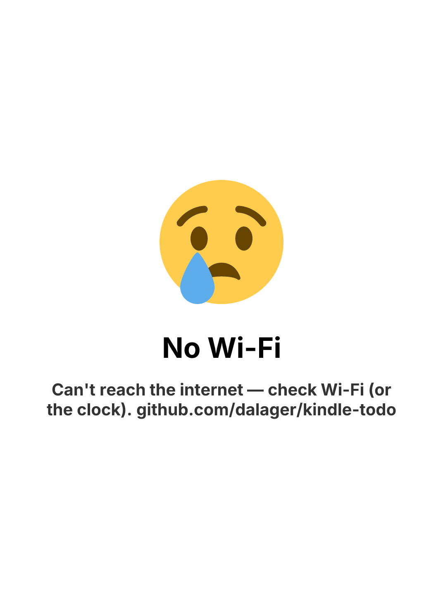 | **No Wi-Fi** — no network, DNS, or TLS (or the device clock is wrong). | Check Wi-Fi; if it changed, use the `DISABLE` escape hatch below. |
| 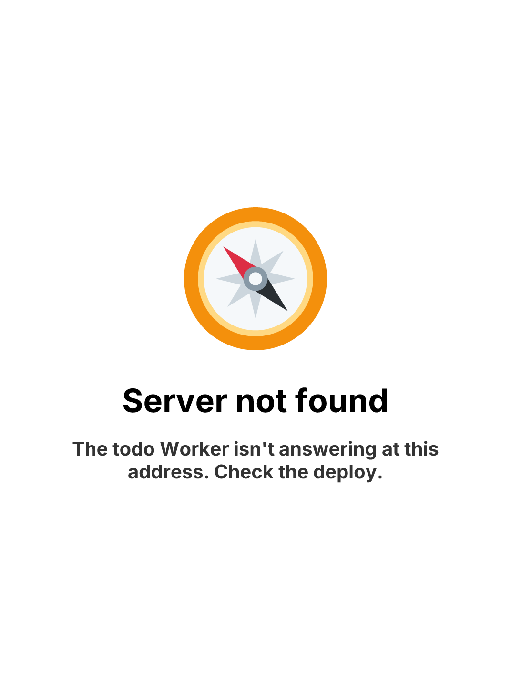 | **Server not found** (404) — wrong URL, route disabled, or not deployed. | Check the deploy / the `BASE_URL`. |
| 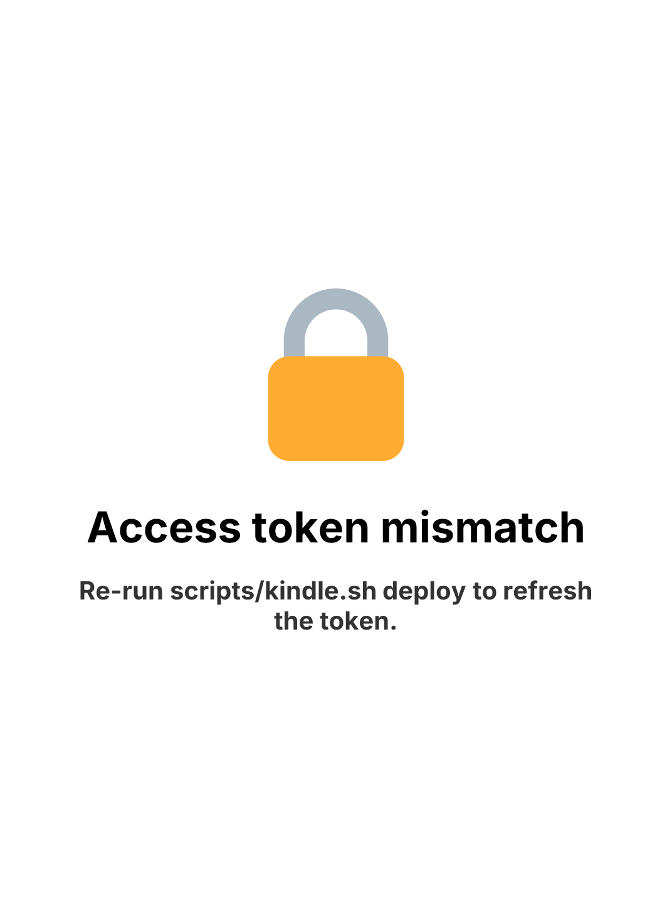 | **Token mismatch** (401) — the device token ≠ the deployed secret. | Re-run `scripts/kindle.sh deploy`. |
| 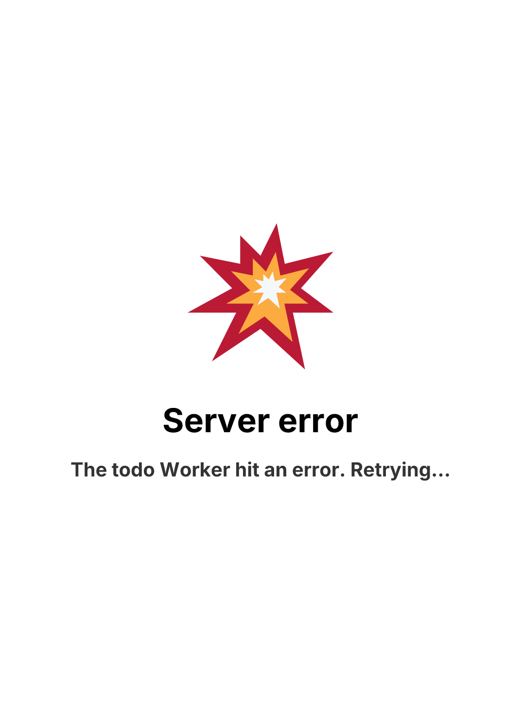 | **Server error** (5xx) — the Worker crashed. | Usually transient; check `wrangler tail` if it persists. |
| 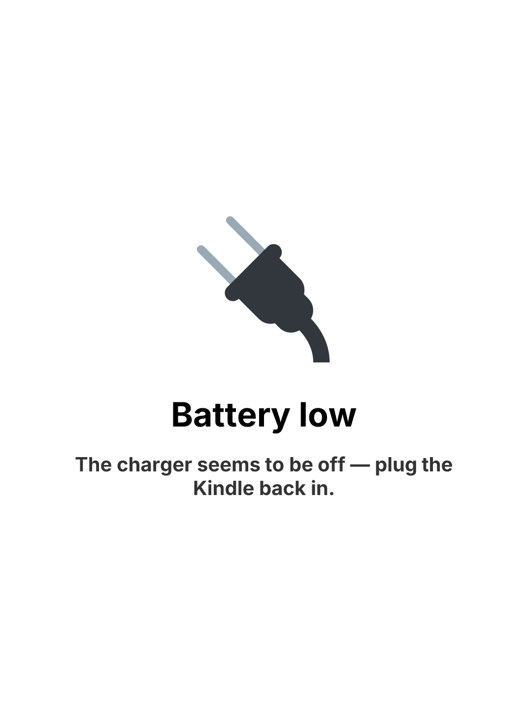 | **Battery low** — discharging below ~20 % (charger off/unplugged). | Restore power; the list returns on the next change. |

> Colors dither to grayscale on the Kindle's e-ink panel; the emoji and text stay
> perfectly legible. Preview any screen live at `/error/<kind>.png?t=<TODO_TOKEN>`.

## Resilience & recovery

The kiosk stops the whole `x` stack (no on-device UI) and redraws **only on
change**. That makes it robust to *content* failures but brittle to *access*
failures. How the common scenarios play out:

| Scenario | What happens | What to do |
|----------|--------------|------------|
| **Battery drain / power cut** | Screen keeps showing the last list (e-ink holds it with no power). On re-plugging it boots and redraws itself. | Nothing — it self-heals. Run it off a wall charger. |
| **Frontlight annoying** | It's the light, not the silent image. | Default is already **off** (`FLINTENSITY=0`). Set it live or in `config.local`. Or shut down — e-ink keeps the image. **Avoid a short power-press (sleep):** an unchanged list returns `304`, so the loop won't repair a cleared/sleep screen until the todos actually change. |
| **Microsoft/Graph down** | Worker keeps serving the last-good list for ~5 min, then renders a "not responding 😵" / "sign-in expired 🔑" screen. | Usually self-heals. "Sign-in expired" needs a new refresh token (see decommission/setup). |
| **Wi-Fi changes** (new password / router / house) | No network → after ~1 min the device draws its local **"No Wi-Fi 😢"** screen (instead of freezing silently). X is stopped, so there's no UI to rejoin, and SSH runs over Wi-Fi. | Easiest: keep the **same SSID + password** when swapping routers and it just reconnects. Otherwise use the **`DISABLE` escape hatch** below to get the normal UI back and rejoin Wi-Fi. |
| **Bad deploy / wrong token** | Device draws **"Server not found 🧭"** (404) or **"token mismatch 🔒"** (401) after ~1 min. | Fix the deploy / re-run `scripts/kindle.sh deploy`. |

### The `DISABLE` escape hatch

If `boot-image.sh` finds a file named `DISABLE` in `extensions/kindletodo/` (or
in `bin/`), it exits **before** stopping `x`, leaving the normal Kindle UI — KUAL,
Wi-Fi settings, KOReader — fully usable. Create it any way you can reach the
device:

- **Over USB** (no shell, no Wi-Fi needed): plug into a computer, and on the
  Kindle's USB drive create an empty file at
  `extensions/kindletodo/DISABLE`, then eject and reboot.
- **Over SSH:** `scripts/kindle.sh ssh 'touch /mnt/us/extensions/kindletodo/DISABLE'` then reboot.

Delete the file (and reboot) to hand the panel back to the kiosk.

### Repurposing the Kindle later (e.g. back to plain KOReader)

You don't need this repo or any secret for this — the goal is just to stop the
kiosk:

1. **Best:** drop the `DISABLE` flag (above), reboot → normal Kindle. To remove
   it permanently, over SSH: `mntroot rw; rm /etc/upstart/kindletodo.conf; mntroot ro`,
   then `rm -rf /mnt/us/extensions/kindletodo`.
2. **If you've lost the SSH password and Wi-Fi:** the `DISABLE`-over-USB route
   still works. Failing that, **factory-reset and re-jailbreak** — that needs no
   secrets and no repo, and gives you a clean KOReader install.

### Decommissioning the cloud side (don't skip this)

Reclaiming the Kindle does **not** stop the Worker — it keeps running and **keeps
a live refresh token to your Microsoft account**, readable by anyone who still
has the token URL. When you retire the board:

- `cd worker && wrangler delete` (or at least
  `wrangler secret delete MS_REFRESH_TOKEN`) to take the Worker offline.
- **Revoke** the Azure app registration / the refresh token in your Microsoft
  account, so nothing can read your To Do lists afterward.

### Keep these outside the repo

The repo deliberately excludes every secret, so save these in a password manager
— without them, recovery falls back to a factory reset:

- **Cloudflare** account (to tear down / rotate the Worker + token)
- **Azure app** registration + **MS refresh token** (to revoke access)
- **`KINDLE_SSH_PASS`** + **Wi-Fi** SSID/password (for graceful device recovery)
- **`TODO_TOKEN`** (minor — rotatable via Cloudflare)

## Secrets & the `.env`

Two git-ignored env files, plus the device's own config — all excluded by
`.gitignore` (`.env`, `.dev.vars`, `*.local`):

| File | Where | Holds |
|------|-------|-------|
| `worker/.dev.vars` | laptop | Worker dev secrets: `TODO_TOKEN` + MS credentials (for `wrangler dev` and `wrangler secret put`) |
| `.env` | laptop | Ops/deploy: `TODO_TOKEN`, `KINDLE_IP`, `KINDLE_SSH_PASS`, `KINDLE_FLINTENSITY` (used by `scripts/kindle.sh`, so you never re-scan for the device) |
| `bin/config.local` | Kindle | just `TODO_TOKEN` — written by `scripts/kindle.sh deploy`, sourced by `boot-image.sh` |

`TODO_TOKEN` must be identical across all three **and** the deployed Cloudflare
secret.

**Finding `KINDLE_IP`:** the device runs a Dropbear SSH server on port 22 —
`nmap -p22 --open 192.168.1.0/24`, or check your router's DHCP leases. Save it in
`.env` once. **`KINDLE_SSH_PASS`** is the USBNetLite root password
(`/mnt/us/usbnetlite/etc/config` on the device).

**Rotating the token** (do all four so nothing 401s for long):

```sh
NEW=$(openssl rand -base64 24 | tr -dc 'A-Za-z0-9' | head -c 24)
sed -i -E "s/^TODO_TOKEN=.*/TODO_TOKEN=$NEW/"   worker/.dev.vars   # 1. Worker dev
sed -i -E "s/^TODO_TOKEN=.*/TODO_TOKEN=\"$NEW\"/" .env             # 2. ops env
cd worker && printf '%s' "$NEW" | wrangler secret put TODO_TOKEN && cd ..   # 3. prod
scripts/kindle.sh deploy                                          # 4. the Kindle
```

## Credits

- Microsoft Graph client ported from **microsoft-todo-cli**.
- PNG rendering by **[@cf-wasm/og](https://github.com/fineshopdesign/cf-wasm)**
  (satori + resvg).
- Kindle jailbreak, **fbink**, **KUAL**, **USBNetLite** from the
  [kindlemodding.org](https://kindlemodding.org) / MobileRead communities.

## License

[MIT](LICENSE) © Christian Dalager
