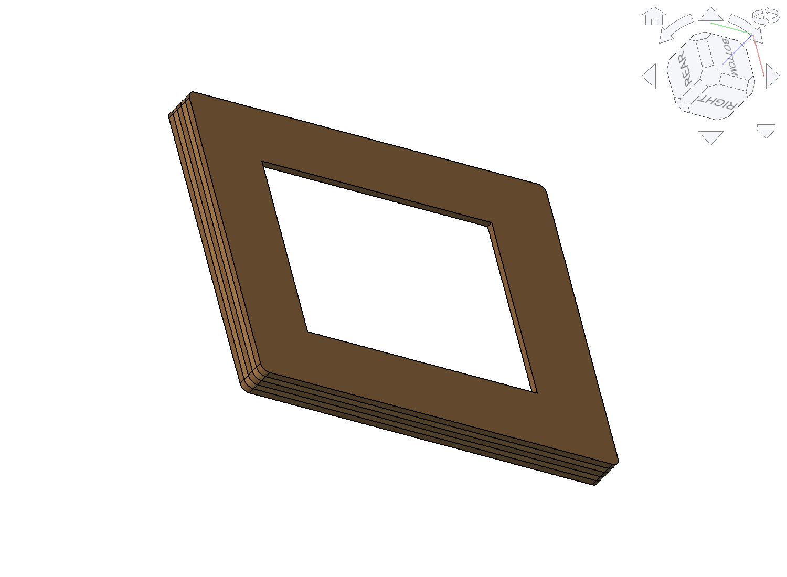

# Wall frame — Kindle Paperwhite 4

A picture-frame style wall mount for the kindle-todo display. The Kindle drops in
from behind, only the e-ink area shows through the front, and the whole thing
hangs **flat** against the wall on two screws — no cleat, no standoff.

**150.8 × 192.2 × 15 mm** · hangs on 2 screws 134.8 mm apart · cable exits the bottom edge

Two ways to build it: **laser-cut plywood** (5 layers glued up) or **3D print**
(one solid part). Both come from the same parametric model.



## Files

| File | What it's for |
|---|---|
| `kindle_frame.py` | **The model.** Parametric FreeCAD script — everything below is generated from it. |
| `make_stl.py` | Fuses the frame layers into one solid and writes the print STL. |
| `laser/kindle_frame.dxf` | **Laser cut file** — all 6 parts nested. Upload this / bring this. Authoritative. |
| `laser/kindle_frame.svg` | Same, for services that prefer SVG. |
| `laser/preview.svg` | Labelled picture of the cut layout (which part is which). |
| `kindle_frame_print.stl` | **3D print file** — frame fused into one solid, back panel excluded. |
| `kindle_frame.step` | 3D assembly (frame layers + back panel) for CAD / reference. |
| `renders/` | Iso, front and side views of the assembly. |

## Design

The frame is a shallow tray. Front face has the window, walls form a pocket the
device sits in, and a removable panel closes the back.

```
 front                                    wall
   |                                        |
   |  L1  3 mm  face .......... window      |
   |  L2  3 mm  pocket ┐                    |
   |  L3  3 mm  pocket ├ device 8.2 mm      |
   |  L4  3 mm  pocket ┘  + keyhole chamber |
   |  L5  3 mm  back ring .. keyhole slots  |
   |      3 mm  back panel (removable)      |
   = 15 mm, flat against the wall
```

**Key dimensions**

| | |
|---|---|
| Outer | 150.8 × 192.2 × 15 mm |
| Window | 91.8 × 123.6 mm (active area 90.8 × 122.6 + 0.5 mm reveal per side) |
| Face borders | sides 29.5 · top 32.1 · bottom 36.5 mm |
| Device pocket | 119.05 × 168.2 × 9 mm |
| Back panel | 124.65 × 177.8 × 3 mm, 5 screws |
| Keyholes | 2 ×, 134.8 mm apart, centres 42.2 mm from the top |

**Details that matter**

- **Keyholes** use a two-layer trick: L5 has the narrow shank slot + round entry,
  L4 behind it has a wider head chamber. Two flat cuts = one keyhole, no milling.
  Hang on pan-head screws with heads **≤ 8.5 mm**.
- **Cable slot** is 14 mm wide and offset **+12 mm from centre** — that's where the
  real micro-USB port is (not centred). It's open front-to-back so you lay the
  cable in before closing the panel.
- **Power button relief**: the device rests on two 15 mm corner pads with the floor
  between them dropped 2 mm, so the bottom-edge power button never gets pressed.
- **Pocket is 119.05 mm wide** — sized off the verified device CAD (117.85 mm), not
  Amazon's nominal 116 mm, so it cannot come out too small. Use felt/foam pads to
  take up slack.

Device geometry verified against
[`docs/devices/kindle-paperwhite-10th-gen-2018.stp`](../docs/devices/kindle-paperwhite-10th-gen-2018.stp);
specs in [`docs/devices/paperwhite_10gen.md`](../docs/devices/paperwhite_10gen.md).

## Build A — laser-cut plywood

**Material:** 3 mm birch plywood. All 6 parts nest in ~480 × 400 mm (half sheet /
A2 offcut). Lime ply also works (paler, softer); avoid the veneer-on-MDF options —
the exposed 15 mm edge would show MDF.

**Where (Copenhagen):**
[Republikken / Makerspace Vesterbro](https://republikken.net/makerspace/) (pay-per-use,
book online) · [FabLab Nordvest](https://www.fablabnordvest.dk/) (200 kr/month) ·
[Copenhagen Fablab](https://copenhagenfablab.kk.dk/en) (free open-lab days).
Mail-order: [Snijlab](https://snijlab.nl/en/collections/wood-laser-cutting) (NL, ships EU).

**Assembly**

1. Cut all 6 parts from the DXF.
2. Dry-stack L1–L5, check the Kindle drops in and the screen lands in the window.
3. Glue **L1–L5** only, clamped flat between two boards. Leave the panel loose.
4. Sand the outer edge (removes laser char), oil if you like.
5. Drop in the Kindle, lay the cable into the bottom slot, screw the panel on.

## Build B — 3D print

`kindle_frame_print.stl` is the frame as **one solid** — the back panel is *not*
included (print or cut your own to **124.65 × 177.8 × 3 mm**; the 5 pilot holes are
already positioned).

**Print it face-down** (window side on the bed): smooth visible front, walls build
straight up, essentially no supports. Don't print back-down — the front lip becomes
a ceiling over the pocket.

| | |
|---|---|
| Material | PETG (or PLA indoors) |
| Layer height | 0.2 mm |
| Perimeters | **4** — the keyholes carry the hanging load |
| Infill | 15–20 % |
| Supports | none (keyhole chambers bridge fine) |
| Volume | 147 cm³ solid → ~40–70 g printed |

Services that ship to DK: [Maker Factory](https://makerfactory.dk/en/pages/online-3d-printing) (🇩🇰),
[Protolabs Network](https://www.hubs.com/3d-printing/denmark/copenhagen/),
[Xometry](https://xometry.eu/en/fdm-3d-printing/), [Sculpteo](https://www.sculpteo.com/en/).

## Hanging it

Two pan-head screws (head ≤ 8.5 mm), **134.8 mm apart**, level. Hook the frame on
and let it slide down ~2 cm. Lifting it straight up takes it off again — that's how
you get to the panel screws for charging or service.

## Regenerating

Edit the parameters at the top of `kindle_frame.py`, then:

```bash
cd frame && snap run freecad.cmd kindle_frame.py
```

That rewrites the STEP, DXF and SVG. Then for the print file:

```bash
snap run freecad.cmd make_stl.py
```

**Run both headless like this**, not through the FreeCAD MCP bridge — the full
rebuild (100+ boolean ops) overloads the Qt event loop and crashes the GUI.
Headless FreeCADCmd has no OpenGL, so it can't render PNGs; for a 3D view, open the
finished STEP in the GUI instead.

Note the scripts use absolute paths under `$HOME` — FreeCAD's snap confinement can't
read `/tmp`.
